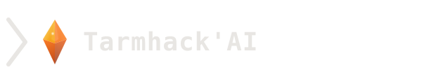
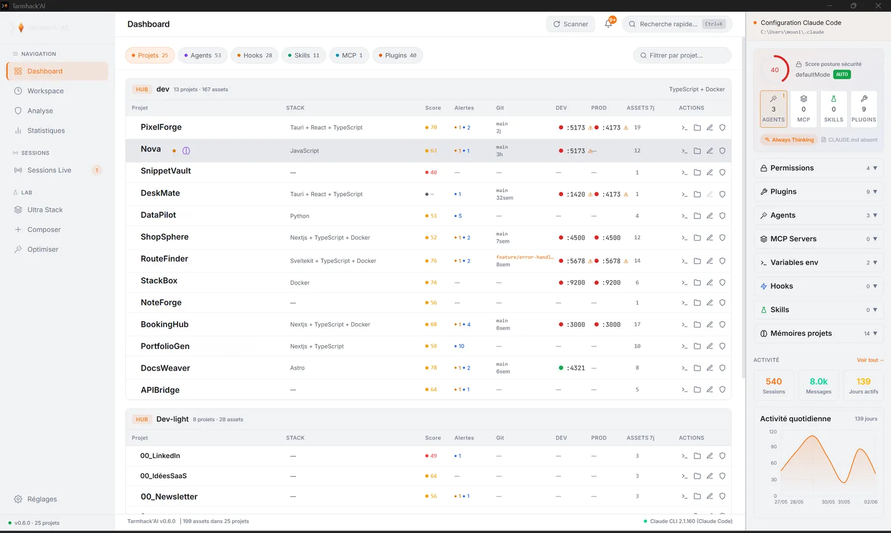

  <picture>
    <source media="(prefers-color-scheme: dark)" srcset="docs/media/logo-light.svg">
    
  </picture>

<h3 align="center">Take back control of your Claude Code environment.</h3>

  
  
  
  

  <a href="https://agence-swel.fr/solutions/tarmhack/"><strong>Website</strong></a> ·
  <a href="https://agence-swel.fr/solutions/tarmhack/telecharger/"><strong>Download</strong></a> ·
  <a href="https://agence-swel.fr/solutions/tarmhack/commander/"><strong>Subscribe</strong></a>

---

**Tarmhack'AI** is a desktop app that **scans, audits and synchronizes** your Claude Code
setup: projects, hooks, skills, agents, MCP servers, `CLAUDE.md` files and permissions.
Your projects, configurations and analyses never leave your machine. No AI API key of its
own, no telemetry.

> Other tools edit files. Tarmhack'AI analyzes, protects, optimizes and syncs.

  

<em>"Claude Code" is a trademark of Anthropic. Tarmhack'AI is an independent product of
Swēl SAS, not affiliated with, sponsored by, or endorsed by Anthropic.</em>

## Download

**[→ Get Tarmhack'AI 1.0.0](https://agence-swel.fr/solutions/tarmhack/telecharger/)** ·
[all release files](https://github.com/Agence-Swel/tarmhack/releases/latest)

| Platform | File |
|---|---|
| **Windows** 10/11 (64-bit) | `.exe` installer, or `.msi` |
| **macOS** (Apple Silicon) | `.dmg`, signed and notarized |
| **Linux** (x86-64) | `.AppImage` or `.deb` |

Start with a **14-day trial, no credit card**.

> **A note for Windows users.** This release is not yet signed with an Authenticode
> certificate, so Windows will show an "unknown publisher" warning at install time. The
> download page explains what you will see. macOS builds are signed and notarized.

## The problem

The status quo holds for one project. It breaks at three. Symlinks, home-made scripts
and visual audits stop scaling the moment your Claude Code projects multiply: no overview,
copy-paste inheritance, silent drift, and security in a blind spot.

## What it does

**See everything** — every Claude Code project in one dashboard: scores, alerts, assets.
Open the terminal, the project folder or any asset in one click.

**Analyze & secure** — a Health Score out of 100 per `CLAUDE.md`, tracked over time. A
hub → projects drift detector. A Secrets Radar and a permissions audit, continuously.

**Edit & propagate** — embedded Monaco editor, drag-and-drop assets between projects, and
an AI Lab that rewrites an asset for its target project — driven by your local Claude Code
CLI. No AI API call from the app.

<strong>The nine functions</strong>

- **Total visibility** — projects, hooks, skills, agents, MCP servers and plugins in one place
- **AI Lab** — describe a hook, agent or skill; the Lab generates it via your local CLI
- **Hub → projects inheritance** — shared configs as a clear tree, with a drift detector
- **CLAUDE.md health score** — a /100 score per file, tracked over time
- **Ultra Stack** — boost a project with a tailored selection of assets
- **Security Radar** — continuous secret scanning + allow/deny permissions map
- **Dead-config detector** — missing hook scripts, unreachable MCP servers, orphan permissions
- **Built-in editor** — Monaco embedded; terminal and folder one click away
- **Daily digest** — what changed since yesterday and each project's next step

## Where your data lives, and what touches the network

**Your work stays on your machine.** Projects, configurations, scans, health scores and
analyses are read and written locally. There is no Tarmhack'AI cloud that mirrors your
data, and no telemetry of any kind, not even opt-in.

Three things do reach the network, and none of them carries your code or your configs:

- **Your licence.** Tarmhack'AI checks it against our licensing provider. What travels is
  your licence key and a derived machine fingerprint, nothing else. The app keeps a signed
  certificate valid for **3 days offline**; past that, it asks you to reconnect once.
- **The AI features.** The Lab, the daily digest and the optimizations drive the **Claude
  Code CLI already installed on your machine**, with your own Claude authentication. That
  CLI needs internet, so those features do too. Everything else, the scans, the audits, the
  editor, works offline.
- **Update checks.** Is your Claude CLI up to date, and is a new Tarmhack'AI available.
  Nothing is sent; versions are compared locally, and the startup check can be turned off.

The full detail, destination by destination, is in **[`SECURITY.md`](SECURITY.md)**.

## Also in this repo

- 📰 **[`watch/`](watch/)** — a weekly, plain-language digest of what changes in the
  Claude Code / Anthropic ecosystem, and why it matters.
- 🧰 **[`resources/`](resources/)** — curated, opinionated resources for running Claude Code
  safely and well — kept current with the ecosystem, not left to rot.

## Pricing

14-day trial, no credit card. Then **€12/month** or **€99/year**, VAT included.

**Founder price: €69/year**, reserved for the first 150 people on the wishlist who
subscribe within 30 days of launch, and held for as long as that subscription stays active.

No API key and no extra AI subscription: Tarmhack'AI uses the Claude Code CLI you already
have.

  <a href="https://agence-swel.fr/solutions/tarmhack/commander/"><strong>→ Subscribe</strong></a> ·
  <a href="https://agence-swel.fr/solutions/tarmhack/telecharger/"><strong>Try it for 14 days</strong></a>

## Status

**Version 1.0.0, available now** on Windows, macOS (Apple Silicon) and Linux.

## License

Tarmhack'AI (the application) is **proprietary software**, and this repository contains
**no product source code**. The reusable configuration templates under
[`resources/templates/`](resources/templates/) are released under the **MIT License**.
All other content (documentation, watch editions, branding) is © 2026 Swēl SAS —
all rights reserved.

---

"Claude Code" and "Claude" are trademarks of Anthropic. Tarmhack'AI is an independent
product of Swēl SAS, not affiliated with, sponsored by, or endorsed by Anthropic; trademark
references are nominative and for identification only. No Anthropic API is called by the app.

Published by <strong>Swēl SAS</strong> (SIREN 104 600 374, Villetelle, France) —
<a href="https://agence-swel.fr/solutions/tarmhack/mentions-legales/">Legal notice</a> ·
<a href="https://agence-swel.fr/solutions/tarmhack/confidentialite/">Privacy policy</a> ·
<a href="https://agence-swel.fr/solutions/tarmhack/cgv/">Terms of sale</a>.
